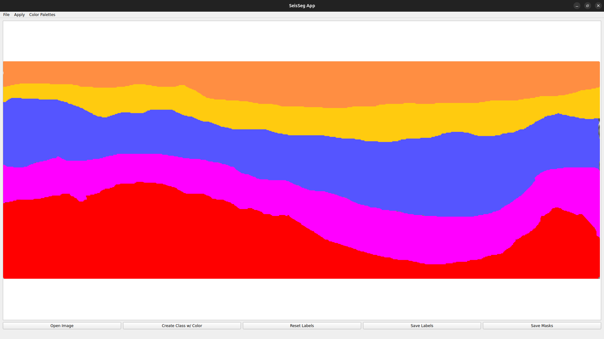

# SeisSeg
Segmentation Tool for Seismic Images


<div align="center">

Annotation for seismic features

> Status: v0.1.7 on-going


</div>

```
Resources:

Python: python3.12.3 venv
Pip packages: Pillow, PyQt5, Numpy, Matplotlib, Scipy, Scikit Image, Tifffile

Status: On-going
```

```
Installation for the source project:

*Recommendation: set Python Venv - version 3.8

Install all the requirements in requirements.txt
```

Instructions to create masks $(baby-steps)$:

I - Go to `Open Image` >> and choose the image in some directory and click on the `Open` buttom.

II - Click with the right mouse button on over the image to change the cursor to a $cross-cursor$.

III - With the left mouse button you can click on the image and drag to start the labeling process. If you release the click, the trace will automatically close the label. You can continue to label where you left off.

IV - To change the color label or create a new label (class), just hit the button `Create Class w/ Color`, and select the desired color, and then `Ok`.

V - You can use the keys `Ctrl+z` to $undo$ the annotation or `Ctrl+y` to $redo$ the annotation, or go to the menu `Edit` to get the same functionalities.

VI - To clean the entire image, you can hit the button `Reset Labels`.

VII - To save the labels, you can hit the button `Save Labels`. Depend on how much colors for each class you created. Areas with no labels will be saved as $background$.

VIII - To save the masks just hit the button `Save Masks`.

To help in the annotation process, you can utilize the menu `Apply`, to apply attributes to the image. Also, utilize the functionalities in the `Color Palettes` menu.

Done

</br>
</br>

> Licence: AGPL-3.0 license

<!-- <style>
  .row {
    width: 100%;
    display: flex;
    flex-direction: row;
    justify-content: center;
  }
  

  p {
    width: 100%;
    display: flex;
    justify-content: center;
    flex-direction: row;
  }
</style> -->
<!-- <p>Collaborators:</p> -->

<div align="center" class="row">

Collaborators:

<a class="block" href="https://github.com/marcfreir" style="border-radius: 50% !important;">
  
</a>

<a class="block" href="https://github.com/eborin" style="border-radius: 50% !important;">
  
</a>


</div>


> SCREENSHOTS
<div align="center">

### Screenshot 1 - Main Window


### Screenshot 2 - Original Image


### Screenshot 3 - Seismic Palette


### Screenshot 4 - Rainbow Palette


### Screenshot 5 - LBP on Rainbow Palette


### Screenshot 6 - GoT


### Screenshot 7 - HOG


### Screenshot 8 - LBP


### Screenshot 9 - Labels



### Screenshot 10 - Result Labels


### Screenshot 11 - Result Annotations


</div>


```
Citation APA format

Freire, M., & Borin, E. (2025). SeisSeg - Seismic Image Segmentation (0.1.7). Zenodo. https://doi.org/10.5281/zenodo.14812035
```

```
Citation BIBTEX

@software{freire_2025_14812035,
  author       = {Freire, Marcos and
                  Borin, Edson},
  title        = {SeisSeg - Seismic Image Segmentation},
  month        = feb,
  year         = 2025,
  publisher    = {Zenodo},
  version      = {0.1.7},
  doi          = {10.5281/zenodo.14812035},
  url          = {https://doi.org/10.5281/zenodo.14812035},
  swhid        = {swh:1:dir:0c30dc7c35347af0f657dee26e6e7c922b2996ea
                   ;origin=https://doi.org/10.5281/zenodo.14812034;vi
                   sit=swh:1:snp:b19f728a3f525dfa382ce0dd9ed378927e0c
                   586b;anchor=swh:1:rel:56e58c0c5c2cba2dd2ac199972fb
                   fc1183c1bbd6;path=seisseg-main
                  },
}
```